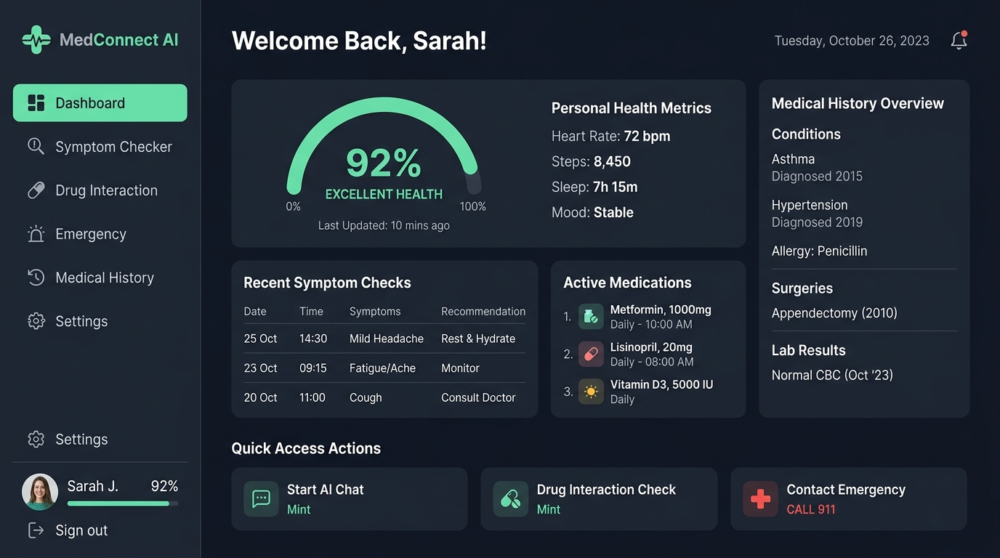
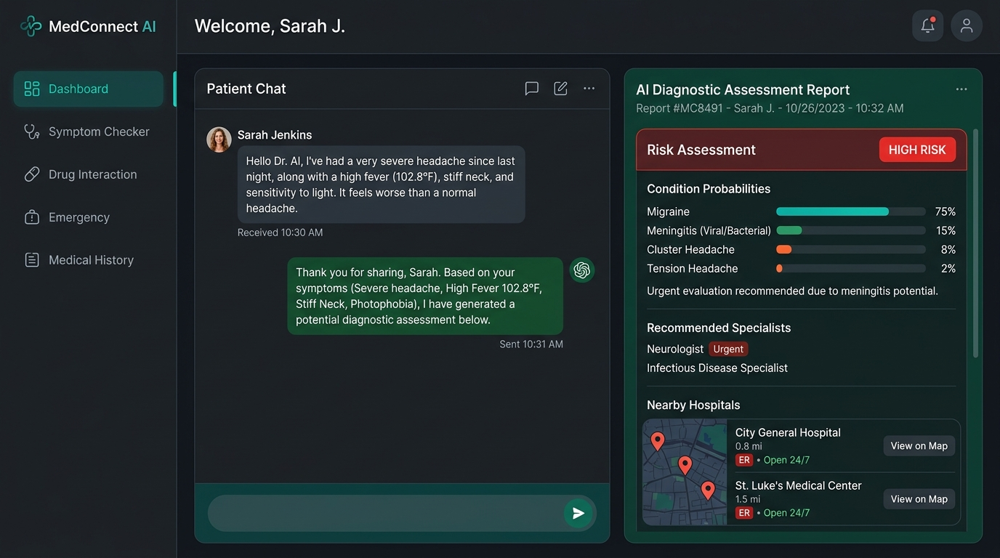
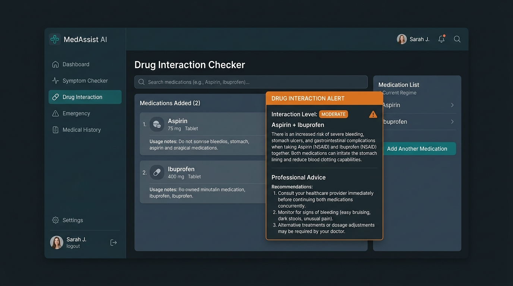

# AI-Powered Healthcare Assistant 🏥

**Final Year Capstone Project**  
An advanced, full-stack, and responsive healthcare assistant application designed to provide interactive symptom analysis, identify potential drug-to-drug interactions, locate nearby emergency services/hospitals, and log patient medical history.

---

## 📸 Screenshots & UI Preview

### 1. Dashboard Overview
A comprehensive dark-themed dashboard presenting key health indices, user metrics, active medication reminders, and quick navigation modules.



### 2. Interactive AI Symptom Checker
An intuitive chat interface that processes natural language symptom descriptions, yields condition probability matches, gauges risk factors, and recommends medical specialists.



### 3. Drug Interaction Checker
A crucial clinical tool allowing patients to search and input multiple drugs to cross-examine database entries for hazardous interaction warnings.



---

## 🌟 Core Features

- **🧠 Smart Symptom Analysis**: Uses a localized knowledge base with rule-based heuristics to analyze severity, duration, and keywords, outputting matched conditions with probability percentages and risk rankings (`LOW`, `MEDIUM`, `HIGH`, `EMERGENCY`).
- **💊 Drug-to-Drug Interaction Checker**: Evaluates combined drug intakes and displays warning thresholds (e.g., Aspirin + Ibuprofen) to prevent hazardous side effects.
- **🚨 Emergency Hospital Locator**: Integrates location-based mock coordinates to display nearby medical centers, specialized doctors, contact information, and emergency response resources.
- **📁 Medical History Logger**: Allows users to log their pre-existing conditions, allergies, and surgical history in a secure digital health record.
- **🔒 JWT Authentication**: Secure login/registration flows with jsonwebtoken-based sessions and local token management.

---

## 🛠️ Tech Stack & Architecture

### **Frontend**
- **Core Library**: React (v19)
- **Bundler/Dev Server**: Vite (v8)
- **Routing**: React Router DOM (v7)
- **Styling**: Vanilla CSS (Tailwind-free custom stylesheets for modular controls)
- **Map Visuals**: Leaflet

### **Backend**
- **Runtime**: Node.js
- **Framework**: Express.js
- **Database ORM**: Mongoose (MongoDB)
- **Security**: Helmet, CORS, Express-Rate-Limit, BCryptJS
- **Session Auth**: JSON Web Tokens (JWT)

### **Database**
- **Primary Database**: MongoDB (Mongoose)
- **In-Memory Fallback**: `mongodb-memory-server` (Instantiated automatically if local MongoDB daemon is offline, making the application run out-of-the-box).

---

## 🚀 Getting Started

### Prerequisites
- [Node.js](https://nodejs.org/) (v16+ recommended)
- [npm](https://www.npmjs.com/)

### Installation

1. **Clone or Extract the Project Directory**
   Ensure you are in the project folder containing the `frontend` and `backend` subdirectories.

2. **Install Backend Dependencies**
   ```bash
   cd backend
   npm install
   ```

3. **Install Frontend Dependencies**
   ```bash
   cd ../frontend
   npm install
   ```

### Running the Project

#### 1. Start the Backend Server
```bash
cd backend
npm run dev
```
*The server will boot on `http://localhost:5000`. If local MongoDB isn't running, it will automatically launch an in-memory MongoDB server instance for testing.*

#### 2. Start the Frontend Server
```bash
cd ../frontend
npm run dev
```
*Vite will compile assets and serve the client app on `http://localhost:5173`.*

### Frontend Deployment

When deploying the frontend, configure `VITE_API_URL` to point at the live backend API, for example:

```bash
VITE_API_URL=https://your-backend-domain.com/api
```

The frontend reads this value from `frontend/src/services/api.js` at build time.

### Railway Backend CORS

If the frontend is deployed on Vercel, set `FRONTEND_URL` in Railway to your Vercel app origin, for example:

```bash
FRONTEND_URL=https://ai-healthcare-assistant-omega.vercel.app
```

The backend also accepts standard `*.vercel.app` origins in production to avoid blocking Vercel preview or redeployed frontend URLs.

---

## 📂 Project Structure

```
AI-HEALTHCARE-ASSISTANT--main/
├── backend/                  # Express.js Server
│   ├── config/               # Database and Env configurations
│   ├── data/                 # Static data stores (Hospitals, etc.)
│   ├── middleware/           # Rate limiting and Error Handlers
│   ├── models/               # MongoDB Schemas (User, History, etc.)
│   ├── routes/               # API endpoints
│   ├── services/             # AI diagnostics and business logic
│   ├── server.js             # Main server entrypoint
│   └── .env                  # Backend environment keys
│
├── frontend/                 # React SPA (Vite)
│   ├── public/               # Static assets & SVG icons
│   ├── src/                  # React Application
│   │   ├── assets/           # UI media files
│   │   ├── components/       # Reusable components (Sidebar, ProtectedRoute, Toast)
│   │   ├── context/          # Authentication React Context
│   │   ├── hooks/            # Context utilities & API hooks
│   │   ├── pages/            # Page layouts (Dashboard, ChatPage, EmergencyPage, etc.)
│   │   ├── services/         # Axios API connection layers
│   │   ├── App.jsx           # Router definitions
│   │   └── main.jsx          # Render entrypoint
│   ├── index.html            # Main HTML document
│   └── vite.config.js        # Vite configurations
└── README.md                 # Project Documentation (This file)
```

---

## ⚖️ Academic Disclaimer
*This system uses a heuristic knowledge base to simulate AI symptoms diagnostics. It is built strictly for academic presentation and demonstration purposes. It does not replace professional medical evaluations or clinical consulting.*
